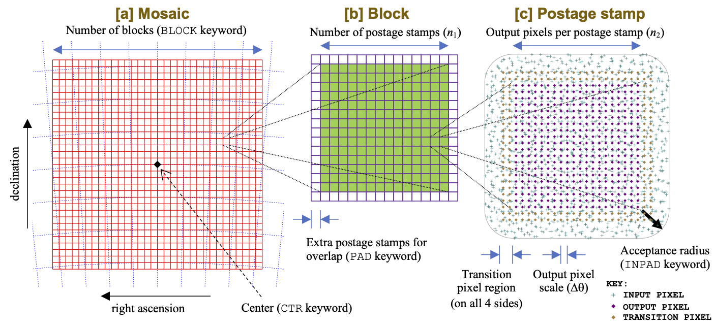

Hierarchical structure of PyIMCOM inputs and outputs
#########################################################

Inputs
**********

The input images for PyIMCOM are specified by observation IDs (a sequential non-negative integer) and SCA (integer, 1-18). PyIMCOM searches the entire list of input data for images that will overlap with its outputs; there is no intermediate level of organization.

Outputs
**********

The PyIMCOM coadded images have 4 layers of hierarchical information. From smallest to largest (and where ``cfg`` is the configuration class):

- The individual output pixel, of size ``cfg.dtheta`` (input in arcsec, but stored internally to PyIMCOM in degrees)

- \[c\] The postage stamp is composed of a square array of ``cfg.n2`` x ``cfg.n2`` output pixels. These are built in the same linear algebra steps. (There are optional transition pixels around the edge that are computed in 2 or - at the corners - 4 postage stamps.)

- \[b\] The block is composed of a square array of ``cfg.n1`` x ``cfg.n1`` postage stamps. The intention is that these are coadded in a single job submitted on a supercomputer.

- \[a\] The mosaic is composed of a square array of `cfg.nblock`` x ``cfg.nblock`` blocks (this is the ``BLOCK`` keyword in the configuration file). A mosaic has a single projection plane on the celestial sphere and is intended to be a higher-level unit of processing (e.g., so that temporary files generated on a scratch disk are available for the rest of the mosaic processing before they need to be cleared). The mosaic center is described by the ``CTR`` keyword.

Orders of magnitude that we would normally consider would be 0.04 arcsec for an output pixel; 1.6 arcsec for a postage stamp; 2 arcmin for a block; and 1 degree for a mosaic. The full survey will consists of many mosaics tiling the sky.

These concepts are graphically displayed as follows:

\[Figure 4 in `Hirata et al., MNRAS 528:2533 (2024) <https://academic.oup.com/mnras/article/528/2/2533/7560566>`_\]
